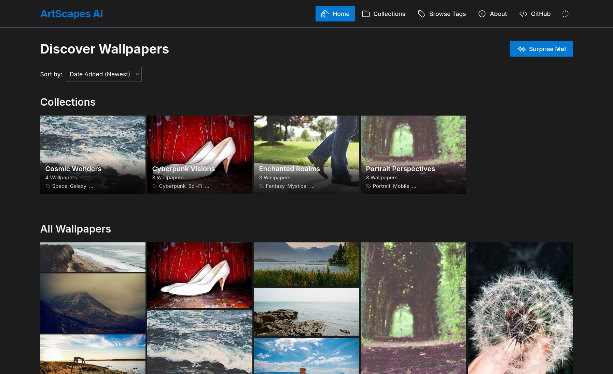

# ArtScapes AI - Stunning AI-Generated Wallpapers 🖼️✨

**Live Demo :** coming soon

**ArtScapes AI** is a visually captivating web application designed to showcase and allow users to download unique, high-resolution wallpapers generated by artificial intelligence. This project serves as a portfolio piece demonstrating modern frontend development practices with a keen eye for UI/UX design.



---

## 🌟 Key Features

*   **Beautiful Wallpaper Gallery:** Discover a diverse collection of AI-generated art, presented in an elegant masonry grid.
*   **Detailed Modal Viewer:** Click on any wallpaper to view it in full resolution with details like title, theme, resolution, and associated tags.
*   **Intuitive Navigation:**
    *   **Previous/Next:** Easily navigate through wallpapers within the modal.
    *   **Keyboard Navigation:** Use arrow keys for previous/next and `ESC` to close the modal.
*   **Themed Collections:** Explore curated collections of wallpapers centered around specific themes (e.g., "Cosmic Wonders", "Cyberpunk Visions").
*   **Tag-Based Discovery:**
    *   **Homepage Filtering:** Filter wallpapers and collections directly on the homepage using a horizontally scrollable tag filter.
    *   **Comprehensive Tag Index:** Browse all available tags alphabetically and view all wallpapers associated with a specific tag.
*   **Sorting Options:** Sort wallpapers by date added (newest/oldest) or title (A-Z/Z-A).
*   **"Surprise Me!" Button:** Instantly view a random wallpaper from the entire gallery.
*   **Direct Downloads:**
    *   Download individual wallpapers in full resolution from the modal or directly from the wallpaper card.
    *   **Batch Download:** Download entire collections as a `.zip` archive from the collection page.
*   **Responsive Design:** Optimized for a seamless experience across desktops, tablets, and mobile devices.
*   **Light/Dark Theme Toggle:** Switch between light and dark themes, with preferences saved in `localStorage`.
*   **Accessibility:**
    *   ARIA labels for interactive elements.
    *   Focus traps within modals to keep keyboard focus contained.
    *   Semantic HTML and consideration for screen reader users.
*   **Smooth Animations & Transitions:** Enhancing the user experience with subtle visual feedback.
*   **Scroll-to-Top Button:** Easily navigate back to the top of the page.

---

## 🛠️ Tech Stack

*   **Frontend:**
    *   **React 19** (with Hooks)
    *   **TypeScript**
    *   **Tailwind CSS** (for styling and utility-first CSS)
    *   **React Router DOM v6** (for client-side routing, using `HashRouter`)
*   **Data:** Static JSON data (currently in `constants.ts`)
*   **Icons:** Heroicons (via custom SVG components)
*   **Build/Dev:** CDN-based setup for quick prototyping (Tailwind CSS, React via esm.sh)

---

## 🚀 Getting Started (Development)

This project uses React and it requires Node.js 20 or above to be installed

1.  **Clone the repository:**
    ```bash
    git clone https://githttps://github.com/svijaykoushik/artscapes-ai/
    cd artscapes-ai
    ```

2.  **Install dependencies:**
    *   `npm ci`
    *   To build and preview:
        ```bash
        npm run build

        npm run preview
        ```
        Then open the provided URL in your browser.

---

## 🎨 About the Wallpapers

The wallpapers showcased are conceptual examples of what AI can generate. In a real-world scenario, these would be created using AI image generation models like:
*   Google Imagen
*   Midjourney
*   Stable Diffusion
*   DALL-E

The prompts and themes are designed to explore a variety of artistic styles. All wallpapers are intended for personal use.

---

## 🔮 Future Enhancements (Ideas)

*   **Backend Integration:** Store wallpapers and collections in a database or bucket.
*   **Advanced Search & Filtering:** More granular search options.
*   **Lazy Loading for Grid:** Optimize performance for very large galleries.
*   **Animations and Micro-interactions:** Further polish the UI with more sophisticated animations.

---

## 📄 License

This project is licensed under the AGPL License - see the [LICENSE](LICENSE) file for details (assuming you'll add one).

---

Developed with ❤️ by Vijaykoushik, S..
Showcasing the creative possibilities at the intersection of AI and art.
